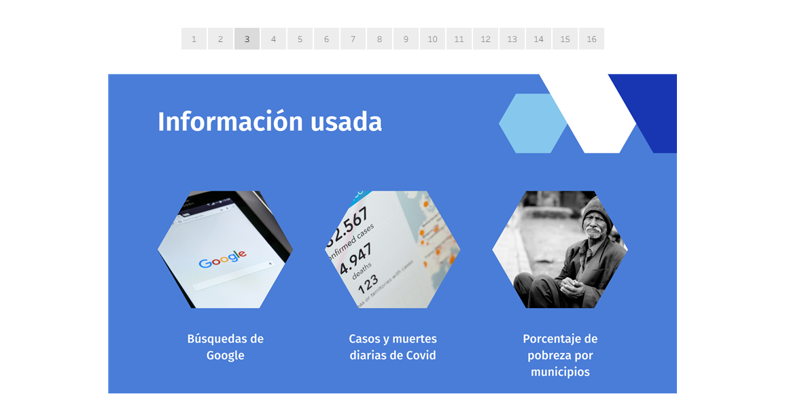
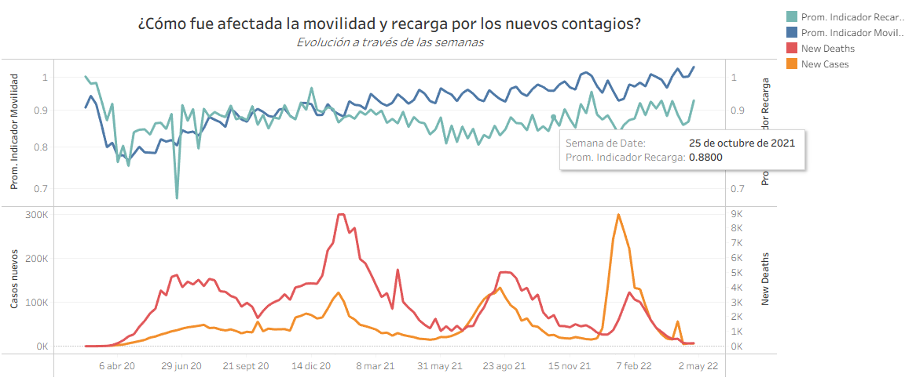
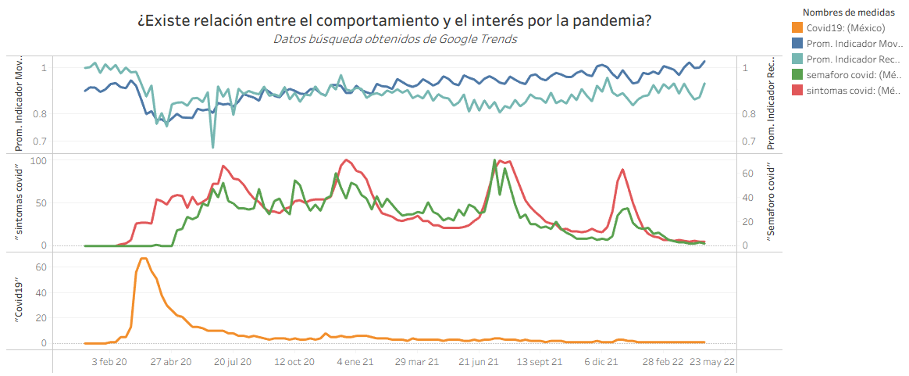
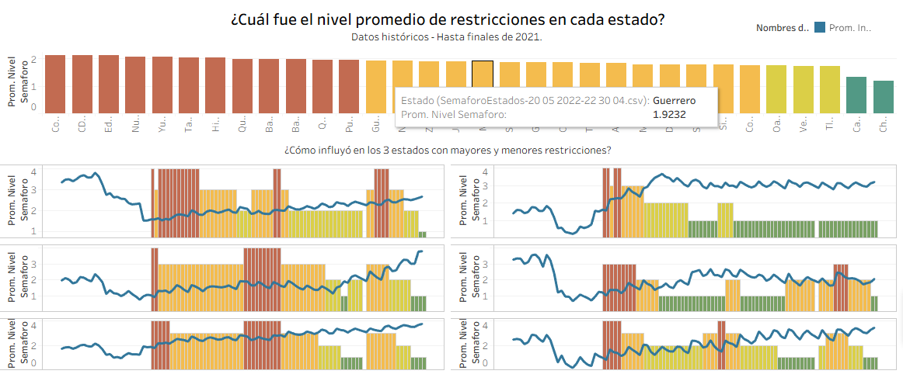
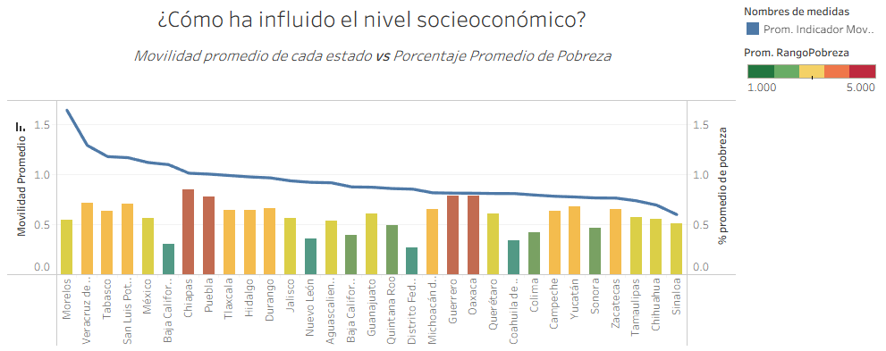
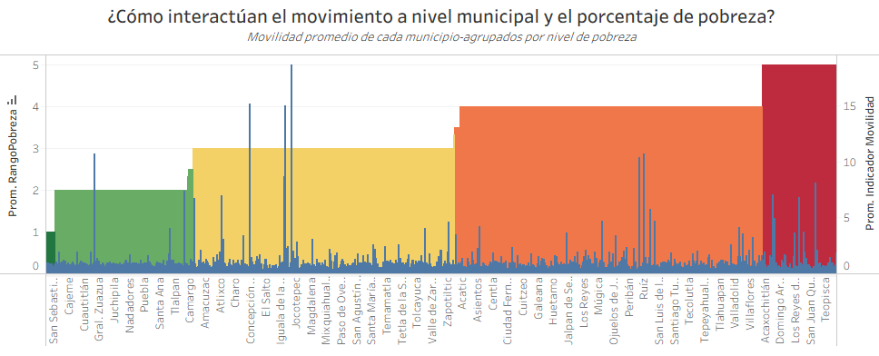
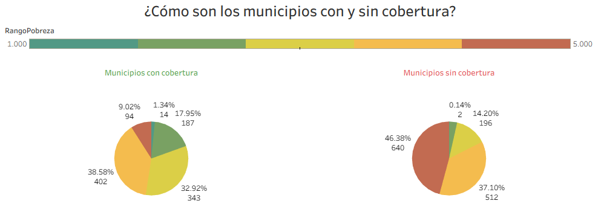
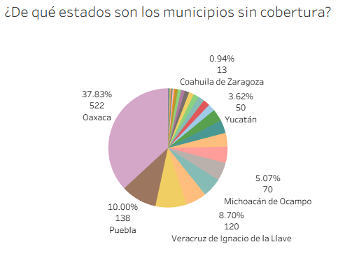

# Análisis de indicadores de clientes y su relación con la pandemia de COVID 19 en empresa de telefonía

**Nota:** este análisis lo realicé en mayo de 2022, participando de manera individual, el concurso duró unos días. En aquel momento no tenía todas las nociones y habilidades de ciencia de datos y aprendizaje máquina con las que cuento ahora (julio de 2026). Está de más decir que sí contaba con mucha experiencia en programación, creación de dashboards y análisis de datos. Combinado con intuición pude crear este análisis. Esta nota la escribo hoy 26 de julio de 2026.

En la carpeta diapositivas se encuentran todos los PNG de la presentación original de PowerPoint. 

----------
  

## INTRODUCCIÓN

Uno de los retos del Datathon de 2022 fue el presentado por Telefónica, quienes buscaban identificar patrones y relaciones entre el comportamiento y recargas de sus clientes con los efectos de la pandemia de COVID 19. La empresa proporcionó un indicador del movimiento geográfico de sus clientes y un indicador de las recargas telefónicas, a nivel nacional y por municipios.

  

## OBJETIVOS

Decidí crear una serie de dahsboards que permitieran:

1.  Visualizar la relación entre las olas de COVID 19 y la movilidad geográfica, así como las recargas telefónicas.
    
2.  Identificar la relación o efectos que pudieran tener las restricciones gubernamentales en los indicadores.
    
3.  Identificar relaciones entre variables socioeconómicas y los indicadores proporcionados.
    

  

## BREVE DESCRIPCIÓN DE LA METODOLOGÍA

Utilicé Tableau para crear gráficas, mientras que se usó Google Colab para crear el dataset del Semáforo COVID. Adicionalmente a los datos proporcionados por Telefónica, se buscó datos de fuentes abiertas como:

-   **INEGI:** para información socioeconómica de municipios
    
-   **Google Trends:** para estimar el interés de la pandemia a través de las búsquedas web.
    
-   Datos de nuevos **casos y muertes por COVID 19**
    
-   Datos del **semáforo epidemiológico de restricciones** de COVID 19
    

  

# GRÁFICAS RELEVANTES Y HALLAZGOS

Aquí muestro los dashboards de las secciones de mi presentación en PowerPoint. Las copio y pego tal como estaban originalmente. Si bien aún falta que sean observaciones más concretas, permiten visualizar bien la relación entre los factores de interés.

  

-   ## Información usada
    

  

-   ## Pandemia y comportamiento (movimiento y recargas)
    

  

-   *En un inicio, los contagios y muertes por COVID impactaron bastante en ambos indicadores, posteriormente, la relación entre los picos de la pandemia y el comportamiento fue más pequeña.*
    
-   *Sí existe correlación con la evolución de la pandemia, pero está desfasada en fechas.*
    
-   *La correlación entre las búsquedas relacionadas al Covid fueron mucho más evidentes y claras.*
    

  
  
  

##   Restricciones y su relación con los indicadores
    

  

-   *Las restricciones sanitarias sí presentaron una relación con el comportamiento en estados con un alto nivel de restricción y con un bajo nivel de restricción.*
    
-   *Las zonas que mostraban mayor correlación indicaban un mayor apego a las medidas de seguridad y de prevención.*
    

  
  

##   El papel del nivel socioeconómico
    

  
  

-   *A nivel municipal, se nota una correlación respecto al promedio de movilidad, ya que los mayores tienden a encontrarse en las zonas menos pobres.*
    
-   *La mayor parte de los municipios en pobreza alta no tienen cobertura de Telefónica, ya que no se tenían registros de movilidad.*
    
-   *Los mayores consumidores o portadores de equipos de Telefónica tendían a encontrarse en zonas más ricas.*
    
-   *Las zonas que menos cubre Telefónica es la de nivel de pobreza 1. Es decir, las zonas más ricas del país. En este caso no correspondió a las más pobres.*
    

  
  
  

# DESCRIPCIÓN DEL PROCESO DE CREACIÓN DEL DATASET

  

1.  Recolecté las imágenes semanales del semáforo de COVID 19 publicados en cada uno de los canales oficiales de la Secretaría de Salud, que en este caso eran YouTube, Facebook y Twitter.
    
2.  Recorté cada una de las imágenes para que tuvieran la misma relación de aspecto. Pues cada estado se seleccionaría mediante sus coordenadas y se revisaría el color del estado en ese momento.
    
3.  Se revisó un pixel de cada uno de los estados y se determinó su color. Asumiendo que el color del semáforo se mantiene entre la fecha de publicación entre uno y otro mapa, se definió con ese color cada uno de los días siguientes para ese estado, hasta que se hubiera publicado el otro mapa.
    
4.  Este proceso se repitió con todos y cada uno de los mapas recortados, de tal forma que se pudiera crear un archivo CSV global que tuviera los datos de cada color de semáforo de cada día para cada estado de la república.
